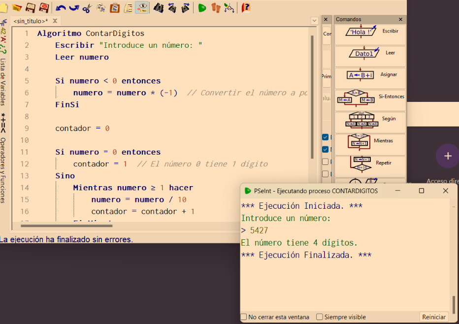

# Algoritmo: Contar Dígitos

Este algoritmo solicita al usuario un número entero, lo convierte a positivo si es negativo, y luego calcula cuántos dígitos tiene.

## Descripción

El algoritmo funciona de la siguiente manera:

1. Pide al usuario que introduzca un número.
2. Si el número es negativo, lo convierte a positivo.
3. Si el número es 0, se cuenta como un solo dígito.
4. En caso contrario, se divide el número por 10 repetidamente hasta que sea menor que 1, aumentando un contador en cada iteración.
5. Finalmente, muestra la cantidad de dígitos.

## Ejemplo de ejecución



## Pseudocódigo

```pseudocode
Algoritmo ContarDigitos 
    Escribir "Introduce un número: "
    Leer numero

    Si numero < 0 entonces
        numero = numero * (-1)  // Convertir el número a positivo
    FinSi

    contador = 0

    Si numero = 0 entonces
        contador = 1  // El número 0 tiene 1 dígito
    Sino
        Mientras numero >= 1 hacer
            numero = numero / 10
            contador = contador + 1
        FinMientras
    FinSi

    Escribir "El número tiene ", contador, " dígitos."
FinAlgoritmo
